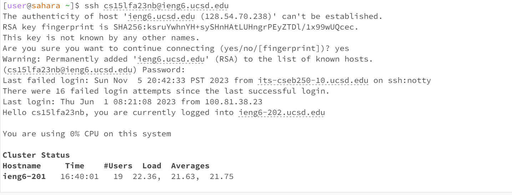
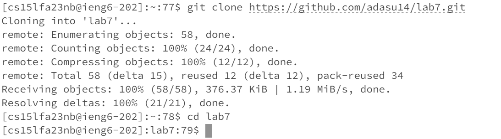
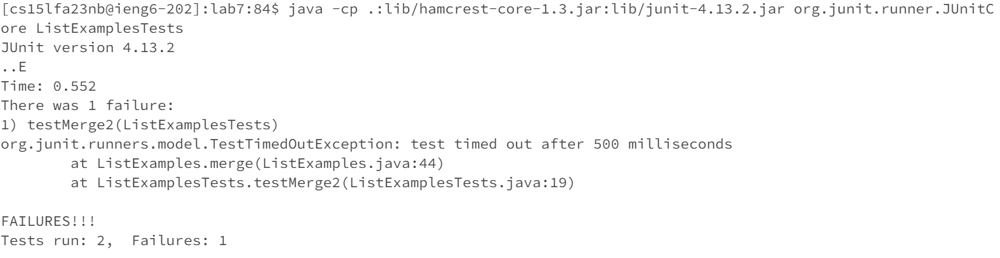
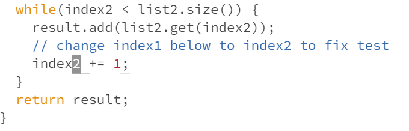
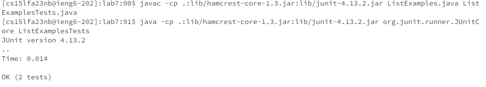
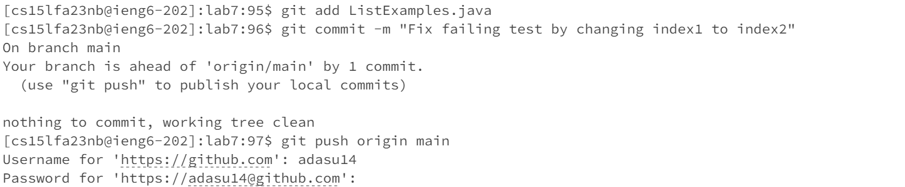

# Lab Report 4

**Step 4: Log into ieng6**


What was typed into the terminal:

To ssh into ieng6, I typed the command:
```
ssh cs15lfa23nb@ieng6.ucsd.edu
```

To answer the question if I wanted to continue connecting, I typed
```
yes
```

I then typed my ieng6 password. I am not including the password so I have just left a comment in the codeblock below.
```java
//password for ieng6
```

Effect: ssh with the username along with the password logged me into the ieng6

**Step 5: Clone your fork of the repository from your Github account**


What was typed into the terminal:

I used this command to clone the fork of the repository:
```git clone https://github.com/adasu14/lab7.git```

I then used this command to change my working directory to lab7
```cd lab7```

Effect: a fork of the repository was created and the working directory was changed to lab7


**Step 6: Running the tests**


I compiled the java files with:
```
javac -cp .:lib/hamcrest-core-1.3.jar:lib/junit-4.13.2.jar lab7/*.java
```

I ran my JUnit tests with:
```
java -cp .:lib/hamcrest-core-1.3.jar:lib/junit-4.13.2.jar org.junit.runner.JUnitCore ListExamplesTests
```

Effect: The first command compiled the java files including ListExamplesTests.java. THe second command ran the JUnit tests. The output was failed tests as shown in the terminal.


**Step 7: Edit the code file to fix the failing test**

Screenshot of corrected while loop


Keys pressed: 
I ran this command in the terminal:

```vim ListExamples.java```
This took me to a vim editor where I could view ListExamples.java

This was followed by: `</>` `<m>` `<e>` `<r>` `<g>` `<e>` `<enter>` which took me to the merge method in the file. I then did `<j>` `<j>` `<j>` `<j>` `<j>` `<j>` `<j>` `<j>` `<j>` `<j>` `<j>` `<j>` `<j>` `<j>` `<j>` `<j>` `<j>` `<j>` `<j>` `<j>` which took me to the line where the final loop in merge was.After that, I typed `<h>` `<h>` `<h>` `<h>` `<h>` `<h>` which took me to the character '1' a part of index1 in the final loop. I then typed `<x>` to remove the character. I then typed `<i>` to go into insert mode. I typed `<2>` to replace where '1' originally was. I pressed `<esc>` to exit insert mode. I then typed `<:>` `<w>` `<enter>` `<w>` `<q>` `<enter>` to save and exit.


**Step 8: Run the tests**

Successful tests


Just like in step 6, I compiled the java files with:
```
javac -cp .:lib/hamcrest-core-1.3.jar:lib/junit-4.13.2.jar lab7/*.java
```

I ran my JUnit tests with:
```
java -cp .:lib/hamcrest-core-1.3.jar:lib/junit-4.13.2.jar org.junit.runner.JUnitCore ListExamplesTests
```

Effect: The first command compiled the java files including ListExamplesTests.java. THe second command ran the JUnit tests. The output was passed tests as shown in the screenshot.

**Step 9: Commit and push**


My first command was:

```
git add ListExamples.java
```
This was to stage changes made to the file listExamples.java for the commit.

The next command was:
```
git commit -m "Fix failing test by changing index1 to index2"
```
This was to create a commit with the changes staged. The -m allowed me to add a commit message.

The last command was:
```
git push origin main
```
This pushed the committed changes to the repository. 

I have not included the details of my GitHub account and password in this lab report which were also a part of this process.